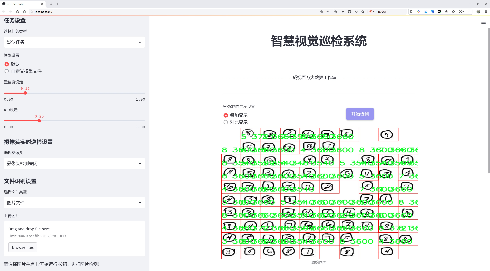
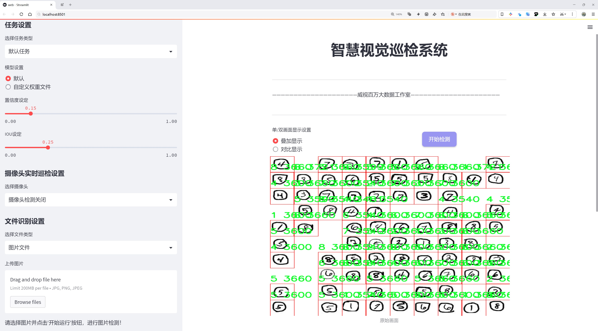
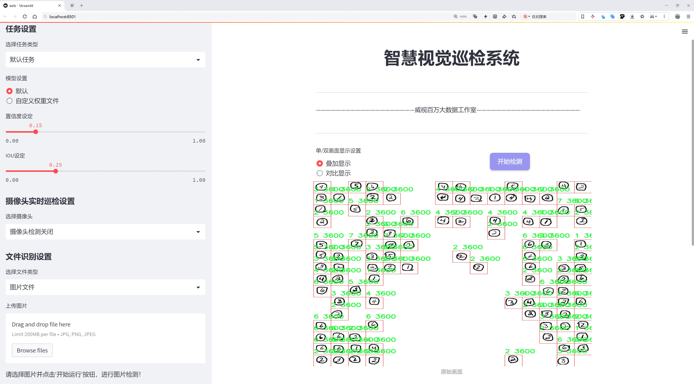
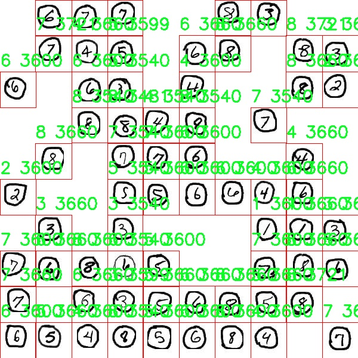
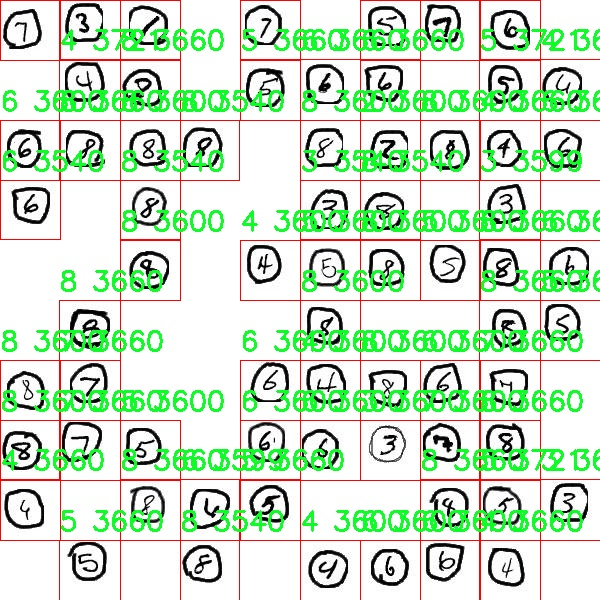
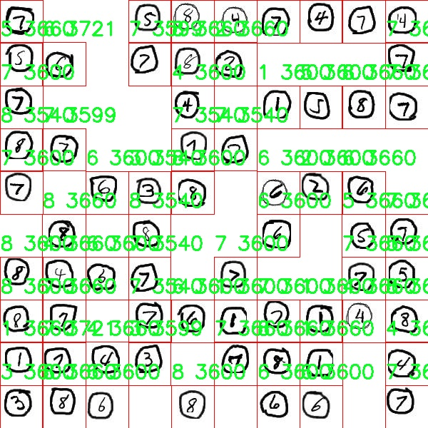
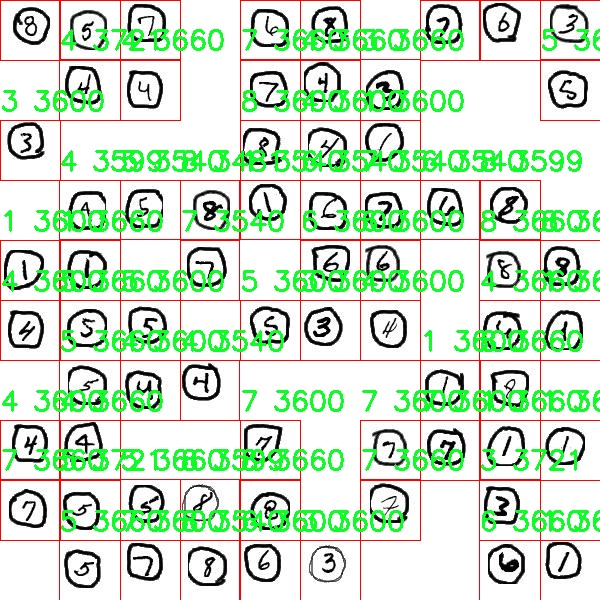
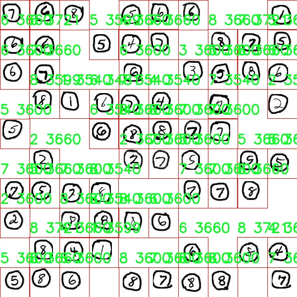

# 手写数字检测检测系统源码分享
 # [一条龙教学YOLOV8标注好的数据集一键训练_70+全套改进创新点发刊_Web前端展示]

### 1.研究背景与意义

项目参考[AAAI Association for the Advancement of Artificial Intelligence](https://gitee.com/qunmasj/projects)

项目来源[AACV Association for the Advancement of Computer Vision](https://github.com/qunshansj/good)

研究背景与意义

随着人工智能技术的迅猛发展，计算机视觉领域的研究日益受到关注。手写数字识别作为计算机视觉中的一个重要应用，广泛应用于银行支票处理、邮政编码识别、自动化表单处理等多个领域。传统的手写数字识别方法多依赖于特征提取和分类器设计，然而，这些方法在处理复杂背景、不同书写风格和模糊图像时，往往表现不佳。近年来，深度学习特别是卷积神经网络（CNN）的兴起，为手写数字识别提供了新的解决方案，显著提高了识别的准确性和鲁棒性。

在众多深度学习模型中，YOLO（You Only Look Once）系列模型因其实时性和高效性而备受青睐。YOLOv8作为该系列的最新版本，进一步优化了模型结构和训练策略，提升了目标检测的精度和速度。然而，现有的YOLOv8模型在手写数字检测任务中的应用仍然存在一定的局限性，主要体现在对手写数字的多样性和复杂性的适应能力不足。因此，基于改进YOLOv8的手写数字检测系统的研究显得尤为重要。

本研究将以Hashiwokakero数据集为基础，该数据集包含9900张手写数字图像，涵盖了从1到8的八个类别。这一数据集的丰富性为模型的训练和评估提供了良好的基础。通过对该数据集的深入分析，可以发现手写数字在书写风格、笔画粗细、背景复杂度等方面的多样性，这为模型的设计提出了更高的要求。为了提高YOLOv8在手写数字检测中的表现，本研究将针对数据集的特点，对YOLOv8进行一系列改进，包括数据增强、模型结构优化和损失函数调整等。这些改进旨在提升模型对不同书写风格和复杂背景的适应能力，从而提高手写数字的检测精度。

本研究的意义不仅在于提升手写数字检测的技术水平，更在于推动深度学习在实际应用中的落地。通过构建一个高效、准确的手写数字检测系统，可以为金融、邮政等行业的自动化处理提供技术支持，降低人工成本，提高工作效率。此外，改进YOLOv8的研究成果也可以为其他领域的目标检测任务提供借鉴，推动计算机视觉技术的进一步发展。

综上所述，基于改进YOLOv8的手写数字检测系统的研究，不仅具有重要的理论价值，还有着广泛的实际应用前景。通过深入探索手写数字识别中的关键技术问题，本研究将为推动智能化时代的到来贡献一份力量。

### 2.图片演示







##### 注意：由于此博客编辑较早，上面“2.图片演示”和“3.视频演示”展示的系统图片或者视频可能为老版本，新版本在老版本的基础上升级如下：（实际效果以升级的新版本为准）

  （1）适配了YOLOV8的“目标检测”模型和“实例分割”模型，通过加载相应的权重（.pt）文件即可自适应加载模型。

  （2）支持“图片识别”、“视频识别”、“摄像头实时识别”三种识别模式。

  （3）支持“图片识别”、“视频识别”、“摄像头实时识别”三种识别结果保存导出，解决手动导出（容易卡顿出现爆内存）存在的问题，识别完自动保存结果并导出到tempDir中。

  （4）支持Web前端系统中的标题、背景图等自定义修改，后面提供修改教程。

  另外本项目提供训练的数据集和训练教程,暂不提供权重文件（best.pt）,需要您按照教程进行训练后实现图片演示和Web前端界面演示的效果。

### 3.视频演示

[3.1 视频演示](https://www.bilibili.com/video/BV1bpHYeXEw1/?vd_source=ff015de2d29cbe2a9cdbfa7064407a08)

### 4.数据集信息展示

数据集信息展示

在本研究中，我们采用了名为“Hashiwokakero”的数据集，以训练和改进YOLOv8手写数字检测系统。该数据集专注于手写数字的识别，包含了丰富的样本和多样化的手写风格，旨在提高模型在实际应用中的准确性和鲁棒性。数据集的类别数量为8，具体包括数字1至8，这些类别涵盖了基本的手写数字形式，为模型提供了广泛的学习基础。

“Hashiwokakero”数据集的设计初衷是为了支持手写数字的自动识别，尤其是在复杂的手写环境中。每个类别的样本均经过精心挑选，确保其代表性和多样性。数字的书写风格各异，既包括常见的印刷体，也涵盖了各种书写习惯下的手写体。这种多样性使得数据集能够有效地模拟现实世界中手写数字的复杂性，进而提升YOLOv8模型在不同场景下的识别能力。

在数据集的构建过程中，研究者们不仅关注样本的数量，更注重样本的质量。每个数字类别的样本均经过严格的标注，确保每个图像都能准确反映其对应的数字。这种高质量的标注为YOLOv8的训练提供了坚实的基础，使得模型能够在学习过程中更好地理解数字的特征和变化。此外，数据集还包含了多种光照条件和背景环境下的手写数字图像，进一步增强了模型的泛化能力。

为了提高模型的训练效率和效果，数据集还采用了数据增强技术。这些技术包括旋转、缩放、平移、添加噪声等，旨在模拟各种可能的书写情况。通过这些增强手段，模型能够在更广泛的场景中进行训练，从而提高其在真实应用中的表现。这种策略不仅提高了模型的准确性，也降低了过拟合的风险，使得YOLOv8在面对新样本时能够保持较高的识别率。

在训练过程中，我们将“Hashiwokakero”数据集与YOLOv8模型相结合，充分利用YOLOv8在目标检测方面的优势。通过精细的调参和优化，我们期望能够实现对手写数字的高效检测与识别。模型的输出不仅包括数字的类别，还将提供每个数字在图像中的位置，这对于后续的应用场景，如自动评分、文档处理等，具有重要意义。

总之，“Hashiwokakero”数据集为本研究提供了一个坚实的基础，支持我们在手写数字检测领域的探索与创新。通过对该数据集的深入分析与应用，我们希望能够推动YOLOv8模型在手写数字识别中的应用，为相关领域的研究与实践提供有力的支持。随着研究的深入，我们期待该模型能够在实际应用中展现出更强的性能，为手写数字的自动识别提供更为精准和高效的解决方案。











### 5.全套项目环境部署视频教程（零基础手把手教学）

[5.1 环境部署教程链接（零基础手把手教学）](https://www.ixigua.com/7404473917358506534?logTag=c807d0cbc21c0ef59de5)


[5.2 安装Python虚拟环境创建和依赖库安装视频教程链接（零基础手把手教学）](https://www.ixigua.com/7404474678003106304?logTag=1f1041108cd1f708b01a)

### 6.手把手YOLOV8训练视频教程（零基础小白有手就能学会）

[6.1 环境部署教程链接（零基础手把手教学）](https://www.ixigua.com/7404477157818401292?logTag=d31a2dfd1983c9668658)

### 7.70+种全套YOLOV8创新点代码加载调参视频教程（一键加载写好的改进模型的配置文件）

[7.1 环境部署教程链接（零基础手把手教学）](https://www.ixigua.com/7404478314661806627?logTag=29066f8288e3f4eea3a4)

### 8.70+种全套YOLOV8创新点原理讲解（非科班也可以轻松写刊发刊，V10版本正在科研待更新）

由于篇幅限制，每个创新点的具体原理讲解就不一一展开，具体见下列网址中的创新点对应子项目的技术原理博客网址【Blog】：


[8.1 70+种全套YOLOV8创新点原理讲解链接](https://gitee.com/qunmasj/good)

### 9.系统功能展示（检测对象为举例，实际内容以本项目数据集为准）

图9.1.系统支持检测结果表格显示

  图9.2.系统支持置信度和IOU阈值手动调节

  图9.3.系统支持自定义加载权重文件best.pt(需要你通过步骤5中训练获得)

  图9.4.系统支持摄像头实时识别

  图9.5.系统支持图片识别

  图9.6.系统支持视频识别

  图9.7.系统支持识别结果文件自动保存

  图9.8.系统支持Excel导出检测结果数据


### 10.原始YOLOV8算法原理

原始YOLOv8算法原理

YOLOv8算法作为目标检测领域的最新进展，承载着YOLO系列模型在精度和速度上的持续优化。其设计理念是通过高效的网络结构和创新的特征提取方法，实现对图像中目标的快速而准确的检测。YOLOv8的架构主要由输入层、主干网络、颈部网络和头部网络四个核心组件构成，每个部分都在前一版本的基础上进行了显著的改进和优化。

在输入层，YOLOv8首先对输入图像进行预处理，以满足特定的输入尺寸要求。这一过程不仅包括简单的缩放，还涉及到Mosaic增强技术，这种技术通过将多张图像拼接在一起，生成新的训练样本，从而提高模型的泛化能力和鲁棒性。此外，YOLOv8还引入了瞄点计算，以确保在不同场景下，模型能够更好地捕捉到目标的位置和特征。

主干网络是YOLOv8的核心部分，负责从输入图像中提取特征。与之前的YOLO版本不同，YOLOv8采用了C2f模块替代了传统的C3模块。C2f模块通过深度卷积和批归一化的结合，能够有效地提取多层次的特征信息。每个卷积层后都使用SiLU激活函数，以增强非线性特征的表达能力。C2f模块的设计灵感来源于YOLOv7中的E-ELAN结构，通过跨层分支连接，增强了模型的梯度流动，从而在特征提取过程中减少了信息的损失。主干网络的最后，SPPFl模块通过三个最大池化层对多尺度特征进行处理，进一步提升了网络的特征抽象能力，使得模型在面对不同尺寸的目标时，能够保持良好的检测性能。

颈部网络的设计同样至关重要，它负责将来自主干网络的特征进行融合。YOLOv8采用了FPNS（特征金字塔网络）和PAN（路径聚合网络）的结合，这种双塔结构有效地促进了不同尺度特征图的信息传递。FPNS专注于高层语义特征的提取，而PAN则增强了低层细节信息的保留，二者的结合使得YOLOv8在处理复杂场景时，能够更好地捕捉到目标的细节与语义信息。这种特征融合的策略，不仅提高了模型对小目标的检测能力，也增强了其在复杂背景下的鲁棒性。

在头部网络部分，YOLOv8采用了解耦的检测头设计。这一创新使得回归和分类的损失计算在两个并行的卷积分支中进行，从而加速了模型的收敛速度。通过这种解耦设计，YOLOv8能够在保持高精度的同时，显著提高检测速度，满足实时应用的需求。此外，YOLOv8在检测头的设计上还引入了无锚目标检测的理念，进一步简化了模型的复杂性，使得目标检测过程更加高效。

值得一提的是，YOLOv8n作为YOLOv8的轻量化版本，专注于在保证检测性能的同时，减少模型的计算量和参数量。通过在主干特征提取网络中使用更轻量化的C2F模块，YOLOv8n能够在较低的计算资源下，依然实现出色的目标检测效果。特征融合层的设计同样经过优化，采用BiFPN网络来提高不同尺度特征信息的提取速度，确保在轻量化的同时，不损失模型的性能。

总的来说，YOLOv8算法通过对网络结构的深度优化和创新设计，展现了在目标检测领域的强大能力。其在特征提取、特征融合和检测头设计上的诸多改进，使得YOLOv8不仅在精度上取得了显著提升，同时在速度和计算效率上也表现出色。这些进步使得YOLOv8在实际应用中，能够满足各种复杂场景下的目标检测需求，进一步推动了计算机视觉技术的发展。随着YOLOv8的推广和应用，未来的目标检测任务将迎来更高的准确性和更快的响应速度，为智能监控、自动驾驶等领域带来更多可能性。


### 11.项目核心源码讲解（再也不用担心看不懂代码逻辑）

#### 11.1 ultralytics\solutions\ai_gym.py

以下是对给定代码的核心部分进行分析和详细注释的结果：

```python
# Ultralytics YOLO 🚀, AGPL-3.0 license

import cv2
from ultralytics.utils.checks import check_imshow
from ultralytics.utils.plotting import Annotator

class AIGym:
    """管理基于姿势的实时视频流中的健身步骤的类。"""

    def __init__(self):
        """初始化AIGym，设置视觉和图像参数的默认值。"""
        self.im0 = None  # 当前帧图像
        self.tf = None   # 线条厚度

        # 关键点和计数信息
        self.keypoints = None  # 姿势关键点
        self.poseup_angle = None  # 上升姿势角度
        self.posedown_angle = None  # 下降姿势角度
        self.threshold = 0.001  # 阈值

        # 存储阶段、计数和角度信息
        self.angle = None  # 当前角度
        self.count = None  # 当前计数
        self.stage = None  # 当前阶段
        self.pose_type = "pushup"  # 姿势类型（如俯卧撑）
        self.kpts_to_check = None  # 需要检查的关键点

        # 视觉信息
        self.view_img = False  # 是否显示图像
        self.annotator = None  # 注释器实例

        # 检查环境是否支持imshow
        self.env_check = check_imshow(warn=True)

    def set_args(self, kpts_to_check, line_thickness=2, view_img=False, pose_up_angle=145.0, pose_down_angle=90.0, pose_type="pullup"):
        """
        配置AIGym的参数。
        Args:
            kpts_to_check (list): 用于计数的3个关键点
            line_thickness (int): 边界框的线条厚度
            view_img (bool): 是否显示图像
            pose_up_angle (float): 设置上升姿势的角度
            pose_down_angle (float): 设置下降姿势的角度
            pose_type: "pushup", "pullup" 或 "abworkout"
        """
        self.kpts_to_check = kpts_to_check  # 设置需要检查的关键点
        self.tf = line_thickness  # 设置线条厚度
        self.view_img = view_img  # 设置是否显示图像
        self.poseup_angle = pose_up_angle  # 设置上升姿势角度
        self.posedown_angle = pose_down_angle  # 设置下降姿势角度
        self.pose_type = pose_type  # 设置姿势类型

    def start_counting(self, im0, results, frame_count):
        """
        计算健身步骤的函数。
        Args:
            im0 (ndarray): 当前视频流帧
            results: 姿势估计数据
            frame_count: 当前帧计数
        """
        self.im0 = im0  # 保存当前帧图像
        if frame_count == 1:
            # 初始化计数、角度和阶段
            self.count = [0] * len(results[0])
            self.angle = [0] * len(results[0])
            self.stage = ["-" for _ in results[0]]
        
        self.keypoints = results[0].keypoints.data  # 获取关键点数据
        self.annotator = Annotator(im0, line_width=2)  # 创建注释器实例

        num_keypoints = len(results[0])  # 获取关键点数量

        # 如果关键点数量发生变化，调整角度、计数和阶段的大小
        if len(self.angle) != num_keypoints:
            self.angle = [0] * num_keypoints
            self.count = [0] * num_keypoints
            self.stage = ["-" for _ in range(num_keypoints)]

        # 遍历每个关键点，计算角度和更新计数
        for ind, k in enumerate(reversed(self.keypoints)):
            # 计算角度
            self.angle[ind] = self.annotator.estimate_pose_angle(
                k[int(self.kpts_to_check[0])].cpu(),
                k[int(self.kpts_to_check[1])].cpu(),
                k[int(self.kpts_to_check[2])].cpu(),
            )
            # 绘制关键点
            self.im0 = self.annotator.draw_specific_points(k, self.kpts_to_check, shape=(640, 640), radius=10)

            # 根据姿势类型更新阶段和计数
            if self.pose_type == "pushup":
                if self.angle[ind] > self.poseup_angle:
                    self.stage[ind] = "up"
                if self.angle[ind] < self.posedown_angle and self.stage[ind] == "up":
                    self.stage[ind] = "down"
                    self.count[ind] += 1

            elif self.pose_type == "pullup":
                if self.angle[ind] > self.poseup_angle:
                    self.stage[ind] = "down"
                if self.angle[ind] < self.posedown_angle and self.stage[ind] == "down":
                    self.stage[ind] = "up"
                    self.count[ind] += 1

            # 绘制角度、计数和阶段信息
            self.annotator.plot_angle_and_count_and_stage(
                angle_text=self.angle[ind],
                count_text=self.count[ind],
                stage_text=self.stage[ind],
                center_kpt=k[int(self.kpts_to_check[1])],
                line_thickness=self.tf,
            )

            # 绘制所有关键点
            self.annotator.kpts(k, shape=(640, 640), radius=1, kpt_line=True)

        # 如果环境支持，显示图像
        if self.env_check and self.view_img:
            cv2.imshow("Ultralytics YOLOv8 AI GYM", self.im0)
            if cv2.waitKey(1) & 0xFF == ord("q"):
                return

        return self.im0  # 返回处理后的图像

if __name__ == "__main__":
    AIGym()  # 实例化AIGym类
```

### 代码核心部分分析
1. **类定义**：`AIGym`类用于管理健身动作的计数和状态。
2. **初始化方法**：`__init__`方法设置了一些默认参数和变量，用于存储图像、关键点、计数等信息。
3. **参数设置方法**：`set_args`方法允许用户自定义关键点、线条厚度、是否显示图像等参数。
4. **计数方法**：`start_counting`方法是核心功能，负责处理每一帧图像，计算关键点的角度，更新计数和阶段，并绘制相应的图像信息。
5. **环境检查和图像显示**：代码中检查环境是否支持图像显示，并在支持的情况下显示处理后的图像。

通过这些核心部分的实现，`AIGym`类能够实时监测和计数用户的健身动作。

这个文件定义了一个名为 `AIGym` 的类，主要用于在实时视频流中基于人体姿态管理健身动作的计数。该类通过分析视频流中的关键点数据，来判断用户的健身动作并进行计数。

在类的初始化方法 `__init__` 中，设置了一些默认值，包括图像处理参数、关键点信息、角度阈值、计数信息、当前阶段和姿态类型等。`self.im0` 用于存储当前帧图像，`self.tf` 表示线条的厚度，`self.keypoints` 用于存储关键点数据，`self.poseup_angle` 和 `self.posedown_angle` 分别表示姿态的上升和下降角度阈值，`self.pose_type` 用于指定当前的健身动作类型（如俯卧撑、引体向上或腹部锻炼）。

`set_args` 方法用于配置一些参数，包括需要检查的关键点、线条厚度、是否显示图像、上升和下降的角度阈值以及姿态类型。这些参数将影响后续的动作检测和计数。

`start_counting` 方法是该类的核心功能，用于根据传入的图像帧和姿态估计结果进行健身动作的计数。该方法首先会检查当前帧的计数和角度信息是否需要初始化。接着，它会遍历每个关键点，根据不同的姿态类型（如俯卧撑、引体向上或腹部锻炼）计算当前的角度，并根据角度的变化更新动作的阶段和计数。该方法还会调用 `Annotator` 类来绘制关键点、角度、计数和阶段信息，并在需要时显示处理后的图像。

最后，在 `if __name__ == "__main__":` 语句中，创建了 `AIGym` 类的一个实例，表明该文件可以作为一个独立的程序运行。整体来看，这个类提供了一种基于计算机视觉的方式来实时监测和计数健身动作，适用于健身应用或运动分析。

#### 11.2 ui.py

```python
import sys
import subprocess

def run_script(script_path):
    """
    使用当前 Python 环境运行指定的脚本。

    Args:
        script_path (str): 要运行的脚本路径

    Returns:
        None
    """
    # 获取当前 Python 解释器的路径
    python_path = sys.executable

    # 构建运行命令
    command = f'"{python_path}" -m streamlit run "{script_path}"'

    # 执行命令
    result = subprocess.run(command, shell=True)
    if result.returncode != 0:
        print("脚本运行出错。")


# 实例化并运行应用
if __name__ == "__main__":
    # 指定您的脚本路径
    script_path = "web.py"  # 这里可以直接指定脚本路径

    # 运行脚本
    run_script(script_path)
```

### 代码核心部分及注释：

1. **导入必要的模块**：
   - `sys`：用于访问与 Python 解释器相关的变量和函数。
   - `subprocess`：用于执行外部命令。

2. **定义 `run_script` 函数**：
   - 该函数接受一个参数 `script_path`，表示要运行的 Python 脚本的路径。
   - 函数内部首先获取当前 Python 解释器的路径，构建运行命令，然后通过 `subprocess.run` 执行该命令。

3. **命令构建**：
   - 使用 `-m streamlit run` 来运行指定的脚本，这里假设使用的是 Streamlit 框架。

4. **错误处理**：
   - 如果脚本运行失败（即返回码不为 0），则打印错误信息。

5. **主程序入口**：
   - 使用 `if __name__ == "__main__":` 确保只有在直接运行该脚本时才会执行以下代码。
   - 指定要运行的脚本路径（这里直接使用了 `"web.py"`）。
   - 调用 `run_script` 函数来执行指定的脚本。

这个程序文件名为 `ui.py`，其主要功能是通过当前的 Python 环境运行一个指定的脚本，具体来说是一个名为 `web.py` 的脚本。程序首先导入了必要的模块，包括 `sys`、`os` 和 `subprocess`，以及一个自定义的路径处理函数 `abs_path`。

在 `run_script` 函数中，首先获取当前 Python 解释器的路径，这样可以确保使用正确的 Python 环境来运行脚本。接着，构建一个命令字符串，这个命令使用 `streamlit` 模块来运行指定的脚本。`streamlit` 是一个用于构建数据应用的库，因此这个程序的目的可能是启动一个基于 `streamlit` 的 web 应用。

然后，使用 `subprocess.run` 方法执行构建好的命令。这个方法会在新的 shell 中运行命令，并等待其完成。如果脚本运行过程中出现错误，返回的 `returncode` 将不为零，程序会打印出“脚本运行出错”的提示信息。

在文件的最后部分，使用 `if __name__ == "__main__":` 语句来确保只有在直接运行 `ui.py` 时才会执行下面的代码。这部分代码指定了要运行的脚本路径（通过 `abs_path` 函数获取 `web.py` 的绝对路径），然后调用 `run_script` 函数来启动这个脚本。

总的来说，这个程序的主要功能是提供一个简单的接口，通过命令行启动一个 `streamlit` 应用，便于用户在当前的 Python 环境中运行特定的脚本。

#### 11.3 ultralytics\models\yolo\classify\predict.py

以下是代码中最核心的部分，并附上详细的中文注释：

```python
import cv2
import torch
from PIL import Image
from ultralytics.engine.predictor import BasePredictor
from ultralytics.engine.results import Results
from ultralytics.utils import ops

class ClassificationPredictor(BasePredictor):
    """
    ClassificationPredictor类，继承自BasePredictor类，用于基于分类模型进行预测。
    """

    def __init__(self, cfg=DEFAULT_CFG, overrides=None, _callbacks=None):
        """初始化ClassificationPredictor，将任务设置为'分类'。"""
        super().__init__(cfg, overrides, _callbacks)  # 调用父类构造函数
        self.args.task = "classify"  # 设置任务类型为分类
        self._legacy_transform_name = "ultralytics.yolo.data.augment.ToTensor"  # 旧版转换名称

    def preprocess(self, img):
        """将输入图像转换为模型兼容的数据类型。"""
        if not isinstance(img, torch.Tensor):  # 如果输入不是torch张量
            is_legacy_transform = any(
                self._legacy_transform_name in str(transform) for transform in self.transforms.transforms
            )
            if is_legacy_transform:  # 处理旧版转换
                img = torch.stack([self.transforms(im) for im in img], dim=0)  # 应用转换并堆叠
            else:
                img = torch.stack(
                    [self.transforms(Image.fromarray(cv2.cvtColor(im, cv2.COLOR_BGR2RGB))) for im in img], dim=0
                )  # 将BGR图像转换为RGB并应用转换
        img = (img if isinstance(img, torch.Tensor) else torch.from_numpy(img)).to(self.model.device)  # 转换为张量并移动到模型设备
        return img.half() if self.model.fp16 else img.float()  # 将uint8转换为fp16或fp32

    def postprocess(self, preds, img, orig_imgs):
        """对预测结果进行后处理，返回Results对象。"""
        if not isinstance(orig_imgs, list):  # 如果原始图像不是列表
            orig_imgs = ops.convert_torch2numpy_batch(orig_imgs)  # 转换为numpy数组

        results = []
        for i, pred in enumerate(preds):  # 遍历每个预测结果
            orig_img = orig_imgs[i]  # 获取对应的原始图像
            img_path = self.batch[0][i]  # 获取图像路径
            results.append(Results(orig_img, path=img_path, names=self.model.names, probs=pred))  # 创建Results对象并添加到结果列表
        return results  # 返回结果列表
```

### 代码说明：
1. **导入库**：导入必要的库，包括OpenCV、PyTorch和PIL等。
2. **ClassificationPredictor类**：该类用于图像分类任务，继承自`BasePredictor`，并重写了初始化、预处理和后处理方法。
3. **初始化方法**：设置任务类型为分类，并定义旧版转换名称。
4. **预处理方法**：将输入图像转换为适合模型输入的格式，包括处理图像的颜色通道和数据类型。
5. **后处理方法**：对模型的预测结果进行处理，生成包含原始图像、路径、类别名称和概率的结果对象列表。

这个程序文件是一个用于图像分类的预测器，属于Ultralytics YOLO框架的一部分。它继承自`BasePredictor`类，专门用于处理分类模型的预测任务。文件的主要功能是加载模型、预处理输入图像、进行预测，并对预测结果进行后处理。

首先，文件导入了必要的库，包括`cv2`用于图像处理，`torch`用于深度学习模型的操作，以及`PIL`用于图像的加载和处理。接着，文件定义了一个名为`ClassificationPredictor`的类，该类扩展了`BasePredictor`类，并设置任务类型为“分类”。

在构造函数`__init__`中，调用了父类的初始化方法，并将任务类型设置为“classify”。同时，它还定义了一个用于处理旧版转换的变量`_legacy_transform_name`。

`preprocess`方法用于将输入图像转换为模型可以接受的数据类型。它首先检查输入是否为`torch.Tensor`类型，如果不是，则根据是否使用了旧版转换进行不同的处理。对于每个图像，使用`cv2`将其转换为RGB格式，然后应用预定义的转换，最后将图像转换为适合模型的格式，并移动到相应的设备上（如GPU）。在处理过程中，图像的数据类型会被转换为半精度或单精度浮点数，以适应模型的要求。

`postprocess`方法则负责对模型的预测结果进行后处理，生成`Results`对象。它首先检查原始图像是否为列表类型，如果不是，则将其转换为NumPy数组。然后，对于每个预测结果，结合原始图像和图像路径，创建一个`Results`对象，并将其添加到结果列表中，最终返回这个列表。

总的来说，这个文件实现了图像分类的预测流程，包括图像的预处理、模型预测和结果的后处理，能够支持多种分类模型的使用。

#### 11.4 ultralytics\models\fastsam\prompt.py

以下是代码中最核心的部分，并附上详细的中文注释：

```python
import os
import numpy as np
import torch
from PIL import Image
import cv2
from ultralytics.utils import TQDM

class FastSAMPrompt:
    """
    Fast Segment Anything Model 类，用于图像注释和可视化。

    属性:
        device (str): 计算设备（'cuda' 或 'cpu'）。
        results: 目标检测或分割结果。
        source: 源图像或图像路径。
        clip: 用于线性分配的 CLIP 模型。
    """

    def __init__(self, source, results, device="cuda") -> None:
        """初始化 FastSAMPrompt，设置源图像、结果和设备，并导入 CLIP 模型。"""
        self.device = device
        self.results = results
        self.source = source

        # 导入并分配 CLIP 模型
        try:
            import clip  # 用于线性分配
        except ImportError:
            from ultralytics.utils.checks import check_requirements
            check_requirements("git+https://github.com/openai/CLIP.git")
            import clip
        self.clip = clip

    @staticmethod
    def _format_results(result, filter=0):
        """将检测结果格式化为包含 ID、分割、边界框、得分和面积的注释列表。"""
        annotations = []
        n = len(result.masks.data) if result.masks is not None else 0
        for i in range(n):
            mask = result.masks.data[i] == 1.0
            if torch.sum(mask) >= filter:
                annotation = {
                    "id": i,
                    "segmentation": mask.cpu().numpy(),
                    "bbox": result.boxes.data[i],
                    "score": result.boxes.conf[i],
                }
                annotation["area"] = annotation["segmentation"].sum()
                annotations.append(annotation)
        return annotations

    @torch.no_grad()
    def retrieve(self, model, preprocess, elements, search_text: str, device) -> int:
        """处理图像和文本，计算相似度，并返回 softmax 分数。"""
        preprocessed_images = [preprocess(image).to(device) for image in elements]
        tokenized_text = self.clip.tokenize([search_text]).to(device)
        stacked_images = torch.stack(preprocessed_images)
        image_features = model.encode_image(stacked_images)
        text_features = model.encode_text(tokenized_text)
        image_features /= image_features.norm(dim=-1, keepdim=True)
        text_features /= text_features.norm(dim=-1, keepdim=True)
        probs = 100.0 * image_features @ text_features.T
        return probs[:, 0].softmax(dim=0)

    def text_prompt(self, text):
        """处理文本提示，将其应用于现有结果并返回更新的结果。"""
        if self.results[0].masks is not None:
            format_results = self._format_results(self.results[0], 0)
            cropped_boxes, cropped_images, not_crop, filter_id, annotations = self._crop_image(format_results)
            clip_model, preprocess = self.clip.load("ViT-B/32", device=self.device)
            scores = self.retrieve(clip_model, preprocess, cropped_boxes, text, device=self.device)
            max_idx = scores.argsort()[-1]  # 获取得分最高的索引
            max_idx += sum(np.array(filter_id) <= int(max_idx))  # 处理过滤的索引
            self.results[0].masks.data = torch.tensor(np.array([annotations[max_idx]["segmentation"]]))
        return self.results

    def everything_prompt(self):
        """返回类中之前方法处理后的结果。"""
        return self.results
```

### 代码核心部分说明：

1. **类定义**：`FastSAMPrompt`类用于图像分割和注释，包含了设备选择、结果存储和源图像路径等属性。

2. **初始化方法**：`__init__`方法负责初始化类的属性，并导入CLIP模型，用于后续的文本处理和图像特征提取。

3. **结果格式化**：`_format_results`方法将检测结果格式化为易于处理的注释列表，包含每个分割的ID、分割掩码、边界框、得分和面积。

4. **相似度计算**：`retrieve`方法使用CLIP模型处理图像和文本，计算它们之间的相似度，并返回softmax分数，便于后续选择最相关的分割结果。

5. **文本提示处理**：`text_prompt`方法接收文本输入，处理并更新分割结果，利用之前格式化的结果和CLIP模型进行相似度计算，选择最相关的分割掩码。

6. **获取所有结果**：`everything_prompt`方法返回当前处理的结果，便于外部调用。

这些核心部分构成了图像分割和注释的基础逻辑，能够根据用户输入的文本提示动态更新分割结果。

这个程序文件定义了一个名为 `FastSAMPrompt` 的类，主要用于图像注释和可视化，特别是在目标检测和分割任务中。该类的构造函数接受源图像、检测结果和计算设备（如 CUDA 或 CPU）作为参数，并尝试导入 CLIP 模型用于线性分配。

类中包含多个静态方法和实例方法，主要功能包括图像分割、结果格式化、边界框提取、绘图、掩码显示、图像检索、图像裁剪以及基于用户输入的点和文本提示。

在 `_segment_image` 方法中，根据给定的边界框坐标对图像进行分割，生成一个新的图像，其中只有指定区域的内容被保留。`_format_results` 方法将检测结果格式化为包含 ID、分割掩码、边界框、置信度和面积的注释列表。`_get_bbox_from_mask` 方法通过对掩码应用形态学变换来提取边界框。

`plot` 方法用于在图像上绘制注释、边界框和点，并将结果保存到指定的输出目录。它使用 `TQDM` 库显示进度条，支持随机颜色掩码、轮廓绘制等选项。`fast_show_mask` 方法则在给定的 matplotlib 轴上快速显示掩码注释。

`retrieve` 方法通过处理图像和文本，计算相似度并返回 softmax 分数。`_crop_image` 方法根据提供的注释格式裁剪图像，返回裁剪后的图像和相关数据。

类中还实现了 `box_prompt`、`point_prompt` 和 `text_prompt` 方法，分别用于根据边界框、点和文本提示调整掩码。这些方法会更新结果中的掩码数据，返回处理后的结果。

最后，`everything_prompt` 方法返回之前处理的结果。整个类的设计旨在提供一个灵活的接口，以便用户能够通过不同的方式与图像分割结果进行交互和调整。

#### 11.5 ultralytics\models\yolo\obb\train.py

以下是经过简化并注释的核心代码部分：

```python
# 导入必要的模块
from copy import copy
from ultralytics.models import yolo
from ultralytics.nn.tasks import OBBModel
from ultralytics.utils import DEFAULT_CFG, RANK

class OBBTrainer(yolo.detect.DetectionTrainer):
    """
    OBBTrainer类，继承自DetectionTrainer类，用于基于定向边界框（OBB）模型的训练。
    """

    def __init__(self, cfg=DEFAULT_CFG, overrides=None, _callbacks=None):
        """初始化OBBTrainer对象，设置配置和参数覆盖。"""
        if overrides is None:
            overrides = {}
        overrides["task"] = "obb"  # 设置任务类型为OBB
        super().__init__(cfg, overrides, _callbacks)  # 调用父类初始化方法

    def get_model(self, cfg=None, weights=None, verbose=True):
        """返回初始化的OBBModel模型，使用指定的配置和权重。"""
        # 创建OBBModel实例，指定输入通道数和类别数
        model = OBBModel(cfg, ch=3, nc=self.data["nc"], verbose=verbose and RANK == -1)
        if weights:
            model.load(weights)  # 如果提供了权重，则加载权重

        return model  # 返回模型实例

    def get_validator(self):
        """返回OBBValidator实例，用于YOLO模型的验证。"""
        self.loss_names = "box_loss", "cls_loss", "dfl_loss"  # 定义损失名称
        # 创建并返回OBBValidator实例
        return yolo.obb.OBBValidator(self.test_loader, save_dir=self.save_dir, args=copy(self.args))
```

### 代码注释说明：
1. **导入模块**：引入必要的模块和类，方便后续使用。
2. **OBBTrainer类**：该类用于训练基于定向边界框的YOLO模型，继承自已有的DetectionTrainer类。
3. **初始化方法**：在初始化时设置任务类型为OBB，并调用父类的初始化方法。
4. **获取模型方法**：创建并返回一个OBBModel实例，支持加载预训练权重。
5. **获取验证器方法**：返回一个OBBValidator实例，用于模型的验证，并定义了损失名称。

这个程序文件定义了一个名为 `OBBTrainer` 的类，该类用于基于定向边界框（Oriented Bounding Box, OBB）模型进行训练。`OBBTrainer` 继承自 `yolo.detect.DetectionTrainer` 类，扩展了其功能以适应 OBB 模型的训练需求。

在文件的开头，导入了一些必要的模块和类，包括 `copy` 模块、`yolo` 模块中的相关功能、`OBBModel` 类以及一些工具函数和常量。

`OBBTrainer` 类的构造函数 `__init__` 接受三个参数：`cfg`（配置文件，默认为 `DEFAULT_CFG`）、`overrides`（用于覆盖默认参数的字典，默认为 `None`）和 `_callbacks`（回调函数，默认为 `None`）。在构造函数中，如果 `overrides` 为 `None`，则初始化为空字典，并将任务类型设置为 "obb"。然后，调用父类的构造函数以完成初始化。

`get_model` 方法用于返回一个初始化的 `OBBModel` 实例。该方法接受三个参数：`cfg`（配置文件）、`weights`（权重文件）和 `verbose`（是否打印详细信息，默认为 `True`）。在方法内部，创建一个 `OBBModel` 实例，并根据提供的权重文件加载模型权重。

`get_validator` 方法返回一个 `OBBValidator` 实例，用于验证 YOLO 模型的性能。在这个方法中，定义了损失名称，包括 "box_loss"、"cls_loss" 和 "dfl_loss"，并创建一个 `OBBValidator` 对象，传入测试数据加载器、保存目录和参数的副本。

整个类的设计旨在为 OBB 模型的训练提供一个清晰的接口和结构，使得用户能够方便地进行模型训练和验证。示例代码展示了如何使用 `OBBTrainer` 类进行训练，用户只需提供模型路径、数据配置文件和训练轮数即可开始训练。

#### 11.6 train.py

以下是代码中最核心的部分，并附上详细的中文注释：

```python
import os
import torch
import yaml
from ultralytics import YOLO  # 导入YOLO模型库
from QtFusion.path import abs_path  # 导入路径处理函数

# 设置设备为GPU（如果可用），否则使用CPU
device = "0" if torch.cuda.is_available() else "cpu"

if __name__ == '__main__':  # 确保该模块被直接运行时才执行以下代码
    workers = 1  # 设置数据加载的工作进程数
    batch = 2    # 设置每个批次的大小

    data_name = "data"  # 数据集名称
    # 获取数据集yaml文件的绝对路径
    data_path = abs_path(f'datasets/{data_name}/{data_name}.yaml', path_type='current')  
    unix_style_path = data_path.replace(os.sep, '/')  # 将路径转换为Unix风格

    # 获取数据集目录路径
    directory_path = os.path.dirname(unix_style_path)
    
    # 读取YAML文件，保持原有顺序
    with open(data_path, 'r') as file:
        data = yaml.load(file, Loader=yaml.FullLoader)
    
    # 修改YAML文件中的路径项
    if 'path' in data:
        data['path'] = directory_path  # 更新路径为数据集目录
        # 将修改后的数据写回YAML文件
        with open(data_path, 'w') as file:
            yaml.safe_dump(data, file, sort_keys=False)

    # 加载预训练的YOLOv8模型
    model = YOLO(model='./ultralytics/cfg/models/v8/yolov8s.yaml', task='detect')  
    
    # 开始训练模型
    results2 = model.train(
        data=data_path,  # 指定训练数据的配置文件路径
        device=device,  # 指定使用的设备（GPU或CPU）
        workers=workers,  # 指定数据加载的工作进程数
        imgsz=640,  # 指定输入图像的大小为640x640
        epochs=100,  # 指定训练100个epoch
        batch=batch,  # 指定每个批次的大小
        name='train_v8_' + data_name  # 指定训练任务的名称
    )
```

### 代码核心部分说明：
1. **设备选择**：根据是否有可用的GPU，选择训练设备为GPU或CPU。
2. **数据集路径处理**：通过`abs_path`函数获取数据集的绝对路径，并将路径格式转换为Unix风格。
3. **YAML文件读取与修改**：读取YAML文件中的数据，更新其中的路径项，并将修改后的内容写回文件。
4. **模型加载与训练**：加载YOLOv8模型，并开始训练，指定训练参数如数据路径、设备、工作进程数、图像大小、训练轮数和批次大小。

这个程序文件`train.py`的主要功能是使用YOLOv8模型进行目标检测的训练。首先，程序导入了必要的库，包括`os`、`torch`、`yaml`和`ultralytics`中的YOLO模型。根据系统是否支持CUDA，程序会选择使用GPU（设备"0"）还是CPU（设备"cpu"）进行训练。

在`__main__`块中，程序首先定义了一些训练参数，如工作进程数`workers`和批次大小`batch`。接着，程序指定了数据集的名称`data_name`，并构建了数据集配置文件的绝对路径。这里的数据集配置文件是一个YAML文件，包含了训练所需的数据路径和其他相关信息。

程序使用`yaml`库读取该YAML文件，并将其中的`path`项修改为数据集所在的目录路径，以确保后续的训练过程能够正确找到数据。修改后的内容会被写回到YAML文件中。

随后，程序加载了YOLOv8模型的配置文件，并准备开始训练。`model.train`方法被调用，传入了多个参数，包括数据配置文件的路径、设备类型、工作进程数、输入图像的大小（640x640）、训练的轮数（100个epoch）、批次大小，以及训练任务的名称。这样，程序就会开始在指定的数据集上进行YOLOv8模型的训练。

整体来看，这段代码实现了从数据准备到模型训练的完整流程，适合用于目标检测任务的深度学习训练。

### 12.系统整体结构（节选）

### 整体功能和构架概括

该项目主要围绕目标检测和图像处理展开，利用Ultralytics YOLO框架和其他相关模块，提供了一整套用于训练、预测和可视化的工具。项目的核心功能包括：

1. **模型训练**：支持YOLOv8模型的训练，能够处理不同类型的数据集（如标准边界框和定向边界框）。
2. **图像分类与检测**：实现了图像分类的预测功能，能够对输入图像进行分类并返回结果。
3. **图像分割与注释**：提供了基于提示的图像分割功能，允许用户通过边界框、点和文本进行交互式的图像注释。
4. **用户界面**：通过图形用户界面（GUI）提供了对数据集的可视化和管理，便于用户进行数据探索和分析。
5. **实用工具**：包含一些辅助工具和模块，支持数据处理、可视化和模型评估等功能。

### 文件功能整理表

| 文件路径                                      | 功能描述                                                       |
|-------------------------------------------|------------------------------------------------------------|
| `ultralytics/solutions/ai_gym.py`       | 实现实时视频流中的健身动作计数，基于人体姿态进行动作检测。                  |
| `ui.py`                                  | 提供一个接口，通过命令行启动一个基于Streamlit的Web应用。                   |
| `ultralytics/models/yolo/classify/predict.py` | 实现图像分类的预测流程，包括图像预处理、模型预测和结果后处理。             |
| `ultralytics/models/fastsam/prompt.py`  | 提供图像注释和分割功能，支持用户通过不同方式（边界框、点、文本）进行交互。  |
| `ultralytics/models/yolo/obb/train.py`   | 定义OBBTrainer类，用于基于定向边界框模型进行训练。                        |
| `train.py`                               | 启动YOLOv8模型的训练流程，配置数据集和训练参数。                          |
| `ultralytics/solutions/__init__.py`     | 初始化解决方案模块，可能包含模块的导入和基本配置。                          |
| `ultralytics/models/sam/modules/decoders.py` | 实现分割模型的解码器功能，处理模型输出并生成分割结果。                     |
| `ultralytics/data/explorer/gui/dash.py` | 提供数据集的可视化和管理界面，便于用户进行数据探索。                        |
| `ultralytics/data/explorer/utils.py`     | 包含数据处理和探索的实用工具函数，支持数据集的加载和预处理。                |

这个表格总结了项目中各个文件的主要功能，展示了它们在整体架构中的作用。

注意：由于此博客编辑较早，上面“11.项目核心源码讲解（再也不用担心看不懂代码逻辑）”中部分代码可能会优化升级，仅供参考学习，完整“训练源码”、“Web前端界面”和“70+种创新点源码”以“13.完整训练+Web前端界面+70+种创新点源码、数据集获取”的内容为准。

### 13.完整训练+Web前端界面+70+种创新点源码、数据集获取


https://mbd.pub/o/bread/ZpqYm59q